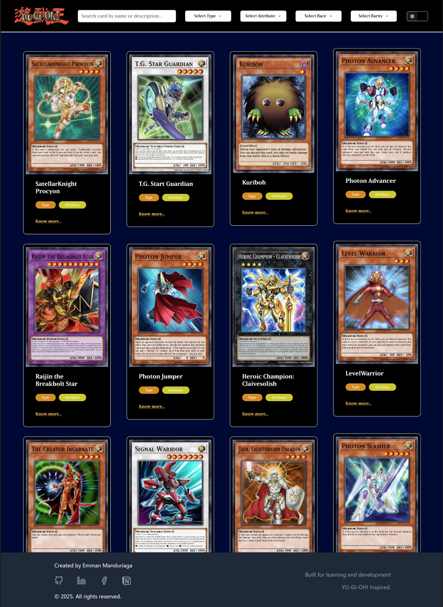

# Exodia UI

**Exodia UI** is a web-based application that displays a comprehensive list of Yu-Gi-Oh! cards using the [YGOPRODeck API](https://db.ygoprodeck.com/api-guide/). It offers a clean and responsive user interface to explore the vast world of Yu-Gi-Oh! cards.

## 🌐 Live Preview

[🔗 View Website Here](#)  
*(Link will be available once deployed)*

## 🌟 Features

- 🔍 View all available Yu-Gi-Oh! cards from the official database
- 📱 Responsive UI design for both desktop and mobile
- ⚡ Fast and lightweight frontend built with modern web technologies
- 🖼️ Card image preview and information display

## 🚧 Pending Updates

I am actively working to improve the user experience. Upcoming features include:

- [ ] **Search and Sorting Functionality**
    - Search cards by name, type, and attribute
    - Sort cards by ATK, DEF, Level, or card name.
- [ ] **Create your Deck**
    - Make your own deck and save it to your computer.
